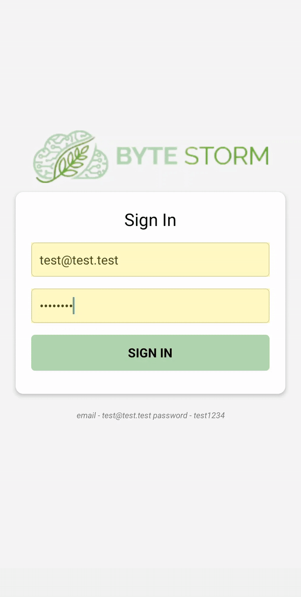
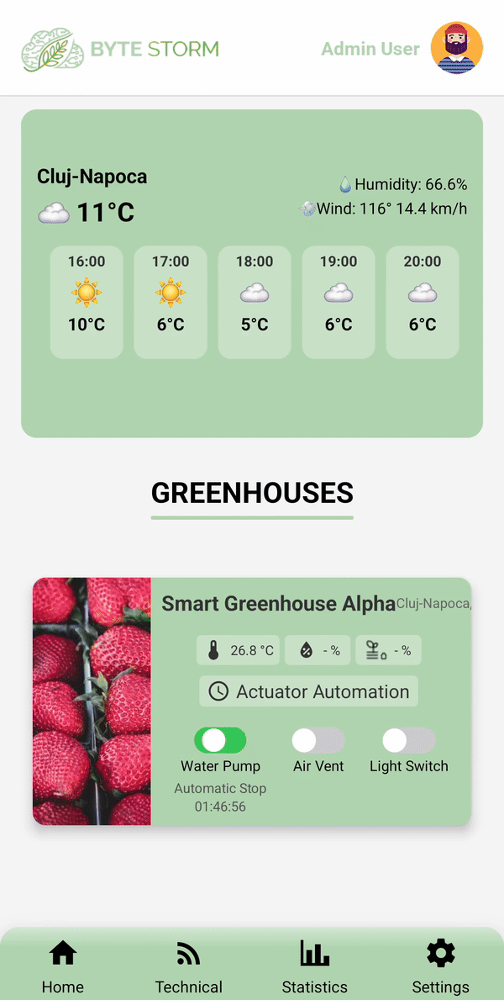
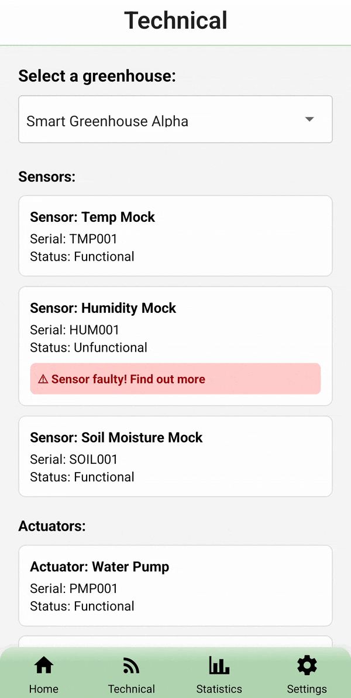
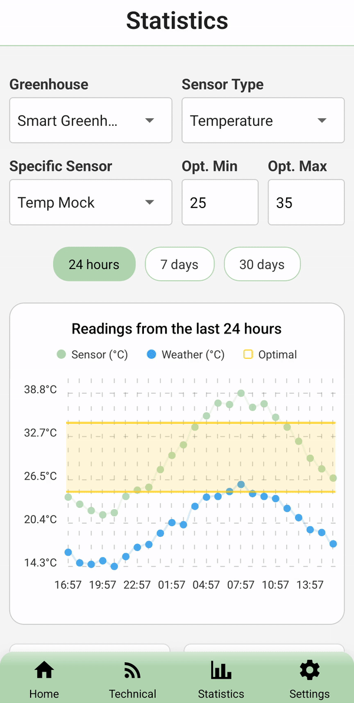

# Smart Greenhouse Management App (React Native)

This repository contains the complete source code for ByteStorm, an IoT-based Smart Greenhouse solution developed as a simulated IT startup project. The system integrates hardware sensors, cloud infrastructure, and a mobile application to allow farmers to monitor and control their crops remotely.

* **Role:** Frontend Team Lead & Full Stack Integrator

* **Focus:** Mobile Application Development, System Architecture, & Local Environment Simulation

---

## ✨ Key Features

The mobile application acts as the control center for the greenhouse, offering:

* **Real-Time Dashboard:** Live monitoring of temperature, humidity, and soil moisture with an integrated weather widget.

* **Actuator Control:** Manual toggle (On/Off) and automated scheduling for irrigation pumps and ventilation fans.

* **Data Visualization:** Interactive charts using Victory Native with time-range filtering (24h, 7 days, 30 days) and "drill-down" capabilities.

* **Technical Diagnostics:** A dedicated maintenance hub showing the health status of every physical sensor/actuator in the greenhouse.

* **Offline/Demo Architecture:** A robust "Simulation Mode" allowing the app to function fully for demonstrations without active hardware connections.

---

## 🛠️ Technologies Used

### Frontend (My Primary Focus)
* **React Native (Expo):** Cross-platform mobile development.
* **Firebase Auth:** Secure user authentication and persistent sessions.
* **Axios:** Optimized API client with interceptors for error handling and security headers.
* **Victory Native:** Complex, interactive data visualization.
* **React Navigation:** Seamless stack and tab-based routing.

### Backend & Infrastructure (Integration Work)
* **Node.js & Express:** RESTful API (Modified for local testing).
* **MySQL:** Relational database for sensor history and user data.
* **XAMPP:** Local database management for the demo environment.
* **IoT Integration:** Logic to handle data flow from Raspberry Pi Pico W devices.

---

## 📸 Application Preview

| **Login & Auth** | **Home Dashboard** | **Technical Hub** | **Statistics** | **Settings** |
| :---: | :---: | :---: | :---: | :---: |
|  |  |  |  |  |

---

## 🎯 Technical Focus & Architecture

While the production version runs on a Linux Cloud VPS (see `cloud/` folder), I re-engineered the backend to allow for **local replication and offline demonstrations**.

**The Problem:** The live sensors and actuators (Hardware) are not always connected, and reliance on a cloud server can risk downtime during demos.

**My Solution:**

1.  **Local Backend Proxy:** I created a `demo_server.js` in the backend that bypasses complex cloud-specific auth middleware, allowing the API to run locally on any machine with XAMPP.
2.  **Smart Connection Guard:** The frontend implements a robust "Health Check" pattern.
    * It attempts to auto-detect the local server IP.
    * If the database or server is unreachable, it intercepts the crash and presents a **user-friendly Connection Error screen** with debugging steps, rather than a blank white screen.
3.  **Data Simulation:** Created helper functions to normalize old database timestamps to "Today," ensuring that charts and statistics always look current and populated, regardless of when the demo is run.

---

## 📂 Project Structure

This monorepo contains the work of all 5 departments. My contributions are primarily in `frontend/` and the adaptation logic in `backend/`.

```text
ByteStorm-Project/
├── frontend/                        # ===> MY MAIN WORK <===
│   ├── assets/                      # Images, fonts, and icons
│   ├── components/                  # UI widgets (Footer, GreenhouseCard, Charts)
│   ├── hooks/                       # Custom hooks (useSafeNavigation)
│   ├── pages/                       # App Screens (Home, Statistics, Settings)
│   ├── services/                    # API Client, Config, & Mock Data Logic
│   ├── utils/                       # Helper functions (Date normalization)
│   ├── App.js                       # Application Entry Point
│   └── README.md                    # Frontend specific docs
│
├── backend/                         # Node.js API
│   ├── config/                      # DB connection & Firebase Admin setup
│   ├── controllers/                 # Business Logic
│   ├── middleware/                  # Auth & Device verification
│   ├── routes/                      # API Endpoint definitions
│   ├── demo_db/                     # SQL Dump & Setup for local testing
│   ├── demo_server.js               # ===> Added by me for Local Testing
│   └── server.js                    # Original Cloud Production Server
│
├── cloud/                           # Infrastructure
│   ├── setup_guide/                 # VPS Configuration Docs
│   └── website/                     # Landing Page (HTML/PHP)
│
├── hardware/                        # IoT Logic
│   └── _pico/                       # Raspberry Pi Pico W Code (MicroPython)
│
└── project_planning/                # Documentation
    ├── Business Plan & Docs
    └── MVP Features
```

---

## 🚀 Getting Started

### 📋 Prerequisites
To replicate this project locally without the live hardware sensors, follow these steps.
### 📋 Prerequisites

* **Node.js** (v18 or higher) installed on your computer.

* **XAMPP** (or any local MySQL server) installed and running.

* **Expo Go App** installed on your physical mobile device (available on Play Store / App Store).

* **Git** to clone the repository.

### 🔧 Installation

**1. Clone the repository:**
```bash
git clone https://github.com/rodel-bfr/smart-greenhouse-react-native-node.git
cd smart-greenhouse-react-native-node
```

**2. Backend Setup**

1. Open **XAMPP Control Panel** and start **Apache** AND **MySQL**.
    * **Note**: Apache is required to access phpMyAdmin.

2. Open phpMyAdmin (usually http://localhost/phpmyadmin).

3. Create a new database named greenhouse_db.

4. Import the greenhouse_db.sql file (located in backend/demo_db/) into this new database.

5. Open a terminal and navigate to the backend folder:
```bash
cd backend
npm install
```

6. Start the Demo Server (This initializes the API in simulation mode):
```bash
node demo_server.js
```

7. You should see a green checkmark confirming the database connection is OK.

**3. Frontend Setup**

1. Open a new terminal window and navigate to the frontend folder:
```bash
cd frontend
npm install
```

2. Start the Expo development server:
```bash
npx expo start
```

3. Connect your Phone:

* You will see a large QR Code in your terminal.

* Android: Open the Expo Go app and scan the QR code.

* iOS: Open the standard Camera app and scan the QR code to open Expo Go.

**4. Troubleshooting:**

* The app attempts to auto-detect your computer's IP address.

* If you see a red "Connection Failed" screen on your phone, open frontend/services/config.js and manually update the HARDCODED_IP constant to match your computer's local IP (e.g., 192.168.1.x).

---

## 📄 Documentation Links

* **[Frontend Documentation](./frontend/README.md):** (This file) Overview of the mobile app architecture and features.
* **[Backend Documentation](./backend/README.md):** API endpoints, database schema, and security protocols.
* **[Hardware Documentation](./hardware/README_hardware.md):** Raspberry Pi Pico W implementation and wiring.
* **[Cloud Infrastructure](./cloud/README_cloud.md):** VPS configuration, Nginx setup, and SSL.
* **[Project Planning](./project_planning/README_project_planning.md):** Business plan, MVP features, and timeline.

---

## 🎓 Academic Context

This project was developed as part of the **Simulated Enterprise** program at **Universitatea Tehnică din Cluj-Napoca (Technical University of Cluj-Napoca)**.

It represents the collaborative effort of a multidisciplinary team simulating a real-world IT startup environment, covering everything from hardware prototyping to cloud deployment and business planning.