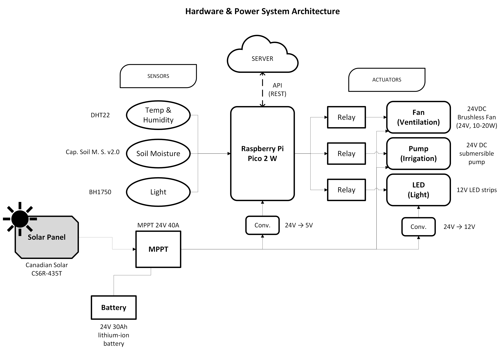
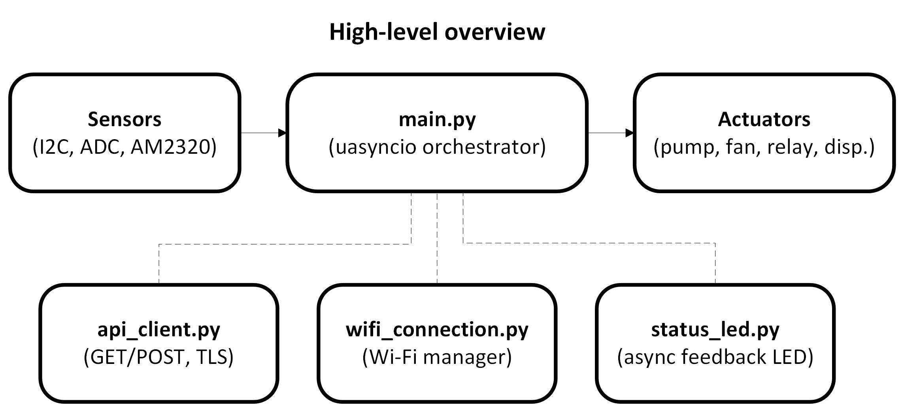
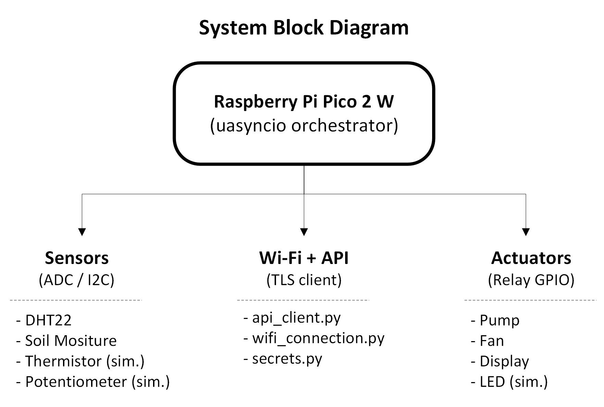
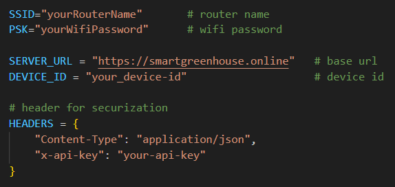

# Smart Greenhouse Automation with Raspberry Pi Pico 2 W
_In-depth documentation & developer guide (hardware + Pico-side software)_

---
### Table of contents
0. [Project Overview](#0-project-overview)
1. [Features](#1-features)
2. [Hardware Design](#2-hardware-design)
3. [Software Architecture](#3-software-architecture)
    - 3.0. [High-Level Overview & System Block Diagram](#30-high-level-overview--system-block-diagram)
    - 3.1. [Hardware Responsibilities](#31-hardware-responsibilities)
    - 3.2. [Folder Structure](#32-folder-structure)
    - 3.3. [Module Breakdown](#33-module-breakdown)
    - 3.4. [Architecture Benefits](#34-architecture-benefits)
4. [Operation Flow](#4-operation-flow)
    - 4.1. [Data transfer flow](#41-data-transfer-flow)
    - 4.2. [Operation Flow on Pico](#42-operation-flow-on-pico)
5. [Deployment & Testing Checklist](#5-deployment--testing-checklist)
6. [Troubleshooting & Common Errors](#6-troubleshooting--common-errors)
7. [Extensions & Next Steps](#7-extensions--next-steps)
8. [Appendix: Useful Code Snippets & Examples](#8-appendix-useful-code-snippets--examples)
    - 8.1. [Auto Control Logic](#81-auto-control-logic)
    - 8.2. [Simplified API Logic](#82-simplified-api-logic)


## 0. Project Overview
**ByteStorm - Smart Greenhouse Automation:** Realization of a complex application for supervision and control of a greenhouse in accordance with the requirements of precision agriculture. The solution includes a mobile application and an IoT system. Learn more about the project on: [smartgreenhouse.online](https://smartgreenhouse.online/ )

**ByteStorm (Hardware):** This project is part of a complex IoT application for supervision and control of a smart greenhouse using a **Raspberry Pi Pico 2 W** as the heart of the system. The current version of the system monitors **soil moisture**, **temperature**, and **humidity**, and controls **pump** and **fan** (or test implementation of these actuators) automatically or via backend commands received from the mobile application through the server.
The project combines **sensors, actuators, Wi-Fi communication, and backend synchronization** in a modular, asynchronous MicroPython framework.

> The project demonstration video with application testing is available on the following link: [ByteStorm - Smart Greenhouse Automation](https://youtu.be/_iiDHFffXV8)

At its core, the system balances:
- **Automatic environmental control** (pump/fan logic)
- **Manual backend overrides**
- **Robust communication with a secured API**
- **Status feedback via LEDs**
The project’s design emphasizes **modularity, resilience, and scalability** — each function isolated in its own module but seamlessly orchestrated through `main.py`.


## 1. Features
- **Automatic control loop**:
    - Threshold-driven (temperature > `TEMP_THRESHOLD` triggers fan, soil < `SOIL_MOISTURE_THRESHOLD` triggers pump).
    - Executes continuously in the background (`sensor_task`).
- **Manual overrides**:
    - Backend commands override auto-control for a configurable `OVERRIDE_TIMEOUT`.
    - Prevents “flip-flop” behavior between server and Pico.
- **Networking**:
    - Pico W communicates with backend over HTTPS (`api_client.py`).
    - POST sensor data and GET actuator commands.
    - API key–based authentication in headers.
- **Startup synchronization**:
    - At boot, Pico fetches server’s last known state (`initial_sync()`) → actuators are immediately aligned.
- **Error handling & resilience**:
    - Automatic Wi-Fi reconnection (`wifi_monitor_task`).
    - Periodic garbage collection with thresholds to prevent RAM starvation.
    - Non-blocking error LED indicator.
- **Development/testing support**:
    - Potentiometer-based simulated sensors (`read_sensors.py`).
    - Real sensors via AM2320/DHT22 (`read_sensors_real.py`).
    - Actuator simulation with **7-seg display** (`actuator_control_display.py`).


## 2. Hardware Design
### MVP Hardware & Power System Architecture
In the MVP version of the project, the implemented architecture contains sensors for monitoring temperature, humidity, soil moisture respectively actuators (or equivalent test implementation) for controlling the irrigation system and the ventilation of the greenhouse.
The system architecture is presented in the figure below. The figure is visual representation, the current MVP version might be different.

#### Core Components
| Component                  | Specification / Role                                       |
| -------------------------- | ---------------------------------------------------------- |
| **Raspberry Pi Pico 2 W**  | Main MCU, Wi-Fi-enabled RP2350 supports 2.4GHz Wi-Fi communication (150 MHz, 520 KB SRAM)      |
| **DHT22 (I²C)**            | Temperature & humidity sensor, 3.3V supply                 |
| **Soil Moisture Sensor**   | Analog probe → ADC input                                   |
| **Pump**                   | DC 12V 3M 240L/H brushless mini submersible water pump    |
| **Fan**                    | DC axial fan (5V/12V)                                      |
| **Relay/MOSFET Drivers**   | Isolate Pico GPIO (3.3V logic) from pump/fan circuits      |
| **LEDs x2** (test version) | For simulating the actuators                               |
| **Power Supply**           | 5V regulated (≥2A recommended, depending on pump/fan load) |
| **Display**                | Optional 7-segment display (simulation) locally           |

> **Note**: Pump, Fan, Relays and Power Supply are not included in MVP

### Wiring principles
- **3.3V safe**: Pico pins → 3.3V max. Use level shifters if needed
- **Motors isolation**: Use external PSU, opto-isolated relays, flyback diodes
- **Grounding**: Shared ground between Pico and drivers
- **I²C**: Pull-up resistors (if not onboard)

### Test Model Pin Assignments (or LEDs instead of actuators)
| Pico Pin | Function | Connected To                   | Notes                               |
| -------- | -------- | ------------------------------ | ----------------------------------- |
| `3V3`    | VCC      | Common power                   | 3.3V units power                    |
| `GND`    | Ground   | Common ground                  | Shared with LEDs/relays/sensors     |
| `GP0`    | I²C0 SDA | DHT22 SDA                      | With pull-up resistor (4.7kΩ)       |
| `GP1`    | I²C0 SCL | DHT22 SCL                      | With pull-up resistor (4.7kΩ)       |
| `GP26`   | ADC0     | Soil sensor output             | Analog read (0–3.3V)                |
| `GP14`   | Digital  | Pump relay IN (LED simulation) | Active HIGH/LOW depending on module |
| `GP15`   | Digital  | Fan relay IN (LED simulation)  | Active HIGH/LOW depending on module |
| `LED`    | Digital  | On-board LED                   | Status LED for feedbacks            |
| `GP27`   | ADC1     | Potentiometer (for test)       | Simulation of humidity sensor       |
| `GP28`   | ADC2     | Thermistor (for test)          | Simulation of temperature sensor    |


## 3. Software Architecture
### 3.0. High-Level Overview & System Block Diagram


### 3.1. Hardware Responsibilities
#### Raspberry Pi Pico 2 W
- **Networking**
    - Secure HTTPS POST (sensor data) and GET (commands).
    - API authentication with `x-api-key`.
    - Wi-Fi monitor task ensures automatic reconnection.
- **Sensors**
    - DHT22 via I²C (temp + humidity).
    - Soil moisture via ADC.
- **Actuators**
    - Auto-control:
        - Fan ON if temperature > threshold.
        - Pump ON if soil moisture < threshold.
    - Manual override:
        - Received from backend via GET request.
        - Timeout ensures auto-control resumes.
- **System Reliability**
    - Async tasks via `uasyncio` (`sensor_task`, `command_task`, `led_task`, `wifi_monitor`, `gc_task`).
    - Exception handling with non-blocking LED error signals.
    - Periodic garbage collection (`gc.collect()`).
#### Backend Responsibilities (related to Hardware)
- Provides **API routes**:
    - `POST /api/data/{DEVICE_ID}` → Receives sensor readings.
    - `GET /api/data/{DEVICE_ID}/commands` → Sends `{ "pump": true/false, "fan": true/false }`.
- Validates `DEVICE_ID` and `x-api-key`.
- Stores incoming data and allows control via UI or automation rules.
### 3.2. Folder Structure
The software architecture ensures a structured and logical folder structure. The project is organized into modular folders for clarity and maintainability:
- The `data_transfer/` folder handles networking, API communication, and Wi-Fi connectivity
- The `helpers/` folder contains the script used for testing different features and the not-implemented-yet improvements like `logger.py`  
- The `lib/` folder contains external libraries (e.g., AM2320 for i2c sensor driver)
- Core logic is in `main.py`, while hardware-specific modules (`actuator_control.py`, `actuator_control_display.py` - use `helpers/test_display.py` for simulation without 7 segment displays, `read_sensors.py` - for test, `read_sensors_real.py` - with real sensors, `status_led.py`, `config.py` - configuration of the system like thresholds) manage the sensors, actuators, and LEDs separately.
This separation keeps networking, sensor handling, and hardware control decoupled, making the system easier to extend and debug. Folder structure presented below.
#### Folder Structure
```
smart-greenhouse-pico/ 
├── data_transfer/ 
│   ├── api_client.py        # Manual HTTPS GET/POST with raw sockets + SSL 
│   ├── secrets.py           # Wi-Fi + API credentials 
│   └── wifi_connection.py   # Async Wi-Fi connect & monitor 
│ 
├── helpers/                 # Test-only scripts (not part of MVP) 
│   ├── api_test.py          # API test client 
│   ├── logger.py            # Logging utility (optional) 
│   └── test_display.py      # Test/demo for display 
│ 
├── lib/ 
│   └── am2320/              # AM2320 I²C sensor library (dependency) 
│ 
├── actuator_control.py           # Relay driver for pump & fan 
├── actuator_control_display.py   # Alternative: 7-seg display actuator feedback ├── config.py                     # Centralized config (thresholds, intervals) 
├── main.py                       # Async orchestration of all tasks 
├── read_sensors.py               # Simulated sensors (potentiometers) 
├── read_sensors_real.py          # Real sensors (DHT22 via I²C) 
└── status_led.py                 # LED status feedback (non-blocking)
```
### 3.3. Module Breakdown
### `data_transfer/`
- **`api_client.py`**
    - Implements **manual HTTPS GET/POST** using sockets + SSL (avoids `urequests` instability).
    - POST → Sends `{temp, humidity, soil_moisture}` payloads.
    - GET → Fetches actuator commands `{pump, fan}`.
    - Minimal RAM footprint, with fallback raw response parsing for debugging.
    - Key function: `api_post_manual(payload)`, `api_get_manual()`
    - Example flow (GET):
        ```
        addr = socket.getaddrinfo(host, 443)[0][-1]
        s = socket.socket()
        s.connect(addr)
        s = ssl.wrap_socket(s)

        req = f"GET {path} HTTP/1.1\r\nHost: {host}\r\n..."
        s.write(req.encode())

        resp = b""
        while True:
            data = s.read(512)
            if not data: break
            resp += data
        s.close()

        body = resp.split(b"\r\n\r\n",1)[1]
        return ujson.loads(body)
        ```
- **`wifi_connection.py`**
    - Manages **asynchronous Wi-Fi connection and reconnection**.
    - Ensures Pico is always online before tasks run.
    - Integrated with **LED feedback**.
    - Key functions: `connect_wifi(timeout=15)`, `is_connected()`
- **`secrets.py`**
    - Securely stores credentials: Wi-Fi **SSID/PSK**, **Server base URL**, **device ID**, Header for secured connection with **API key**
    - Ignored from version control.
---
### `main.py`
The **orchestrator** — coordinates sensors, actuators, Wi-Fi, and backend sync using `uasyncio`.

**Tasks defined:**
- **`sensor_task()`** → Reads sensors, applies auto-control, POSTs updates.
- **`command_task()`** → Fetches backend commands, applies manual overrides.
- **`auto_control()`** → Enforces thresholds when not overridden.
- **`gc_task()`** → Scheduled garbage collection + free memory reporting.
- **`wifi_monitor_task()`** → Maintains Wi-Fi connection.
- **`led_task()`** → Runs heartbeat LED.
- **`initial_sync()`** → Aligns Pico actuators with backend state at boot.

The result is **responsive, fault-tolerant operation** where no single failure blocks the system.

---
### `status_led.py`

Provides **non-blocking LED patterns** for real-time feedback:
- Startup sequence
- Wi-Fi connected
- Sending in progress
- Error signal
- Continuous heartbeat

This offloads debugging onto the hardware itself, ensuring developers know system state without serial logs.

---
### `actuator_control.py`

Controls **pump and fan relays**:
- `set_pump(state: bool)`
- `set_fan(state: bool)`

Get **actuator status**:
- `get_pump_state()`
- `get_fan_state()`

Direct GPIO toggling for reliable actuator control. Integrated into both **auto** and **manual** control flows.

**Extension:**
- `actuator_control_display.py` → Instead of physical relays, outputs animation based on actuator state on a **7-segment display**.
- `helpers/test_display.py` → Ensures testing of display function in terminal

---
### `read_sensors.py` (Simulation Mode)

Implements **sensor simulation** using **potentiometers** on ADC pins:
- `read_temperature()`
- `read_humidity()`
- `read_soil_moisture()`

This enables **development & testing** without real greenhouse hardware. Threshold logic, POST/GET requests, and overrides can all be validated.

---
### `read_sensors_real.py` (Real Hardware)

Implements **real sensor readings** with:
- **DHT22** for temperature & humidity
- **Soil moisture probe** via ADC
- Communication handled via **I²C** (AM2320 library in `lib/`)
---
### `config.py`

Contains data for **system initialization**:
- **Sensor intervals**:
  - `SEND_INTERVAL` - seconds between sensor uploads
  - `CHANGE_THRESHOLD` - change detection threshold
  - `COMMAND_POLL_INTERVAL` - seconds between command checks
  - `GC_INTERVAL` - seconds between forced garbage collections
  - `WIFI_CHECK_INTERVAL` - seconds between WiFi checks
- **Auto control thresholds**:
  - `TEMP_THRESHOLD` - °C - turn fan ON above this
  - `SOIL_MOISTURE_THRESHOLD` - % - turn pump ON below this
- **Override behavior**:
  - `OVERRIDE_TIMEOUT` - seconds before auto-control resumes 
### `helpers/`
- `api_test.py`: test GET/POST against server.
- `logger.py`: consistent logs with timestamps.
- `test_display.py`: simulates 7-segments display output in terminal.
### 3.4. Architecture Benefits
- **Asynchronous architecture** → Every task (sensors, commands, Wi-Fi, LEDs, GC) runs independently without blocking.
- **Separation of concerns** → Sensors, actuators, Wi-Fi, and backend are modularized for maintainability.
- **Simulation-ready** → Potentiometers and display provide low-cost dev tools.
- **Resilience built-in**:
    - Wi-Fi auto-reconnect
    - Garbage collection thresholds
    - Try/except in every task
    - LED hardware feedback
- **Scalable & Extensible** → Adding new actuators/sensors only requires extending two modules, without touching core logic.
- **Backend synchronization** → Prevents startup conflicts and ensures Pico is consistent with the server.


## 4. Operation Flow
### 4.1. Data transfer flow
- **Sensor to application**:
	1. Pico reads temp., humidity and start/stop actuators →
	2. Transfer data to Express API →
	3. Server saves data in DB → 
	4. App takes and displays data to user 
- **User to actuators**:
	1. User start/stop irrigation or ventilation process manually →
	2. App transfers the request to API →
	3. Servers send command to Pico →
	4. Pico activates the actuators (pumps, fans) →
	5. Confirmation is sent back to the server then to the app
### 4.2. Operation Flow on Pico
1. **Startup Phase**
    - **LED Startup Sequence**
        - The status LED runs a short blink pattern to confirm the device is powering up and firmware is alive.
    - **Wi-Fi Connection**
        - Pico attempts to connect to the configured Wi-Fi network (`wifi_connection.connect_wifi()`).
        - If successful, the LED provides a _Wi-Fi connected_ signal (e.g., long blink).
        - If unsuccessful within the timeout, the system raises an error and retries until a stable connection is established.
    - **Initial Backend Sync**
        - Before entering full runtime, Pico queries the backend (`api_get_manual()`) for the last known actuator states.
        - These are applied immediately to ensure alignment between device and backend from the very first cycle.
        - If no commands are available, system defaults to **auto-control mode**.
2. **Runtime Phase (Concurrent Tasks with uasyncio)**
    - **Sensor Task**
        - Periodically samples sensor values (temperature, humidity, soil moisture).
        - Compares new readings against last-known values using `CHANGE_THRESHOLD` to avoid redundant traffic.
        - If a significant change is detected → sends a **POST request** with updated values to backend (`api_post_manual`).
        - After each successful POST → LED flashes quickly to provide user-visible feedback.
    - **Auto Control Task (embedded in sensor_task)**
        - Applies thresholds (`TEMP_THRESHOLD`, `SOIL_MOISTURE_THRESHOLD`) to determine desired actuator states.
        - Only executes auto-control if no manual override is active.
        - Updates actuators (pump, fan) through `actuator_control.py`.
    - **Command Task**
        - Polls backend at fixed intervals (`COMMAND_POLL_INTERVAL`) using **GET requests**.
        - If new actuator commands are received (`{"pump": true/false, "fan": true/false}`):
            - Updates actuator states immediately.
            - Flags corresponding `manual_override_*` to ensure backend command takes priority.
            - Resets `last_command_time` to track override timeout.
    - **LED Task**
        - Runs as a background coroutine.
        - Provides continuous **heartbeat signal** to indicate that the main loop is alive.
        - Responds to event triggers (Wi-Fi success, sending update, error) with unique blink patterns.
    - **Wi-Fi Monitor Task**
        - Continuously checks connectivity (`wifi_connection.is_connected()`).
        - If disconnected, triggers reconnection attempts and LED notification.
        - Prevents “silent failure” by ensuring sensor and command traffic always has a valid network path.
    - **Garbage Collection Task**
        - Periodically calls `gc.collect()` and logs free memory.
        - Prevents RAM fragmentation and long-term memory leaks on constrained hardware.
        - Works in parallel without interfering with blocking POST/GET requests.
3. **Manual Override Mode**
    - **Trigger**
        - Activated when the backend sends explicit actuator commands, e.g.:
            `{ "pump": true, "fan": false }`
    - **Effect**
        - Overrides auto-control logic.
        - Pump and/or fan states are forced into the backend-defined values regardless of sensor thresholds.
        - LED feedback shows actuators being toggled in manual mode.
    - **Timeout Recovery**
        - Override is temporary. After `OVERRIDE_TIMEOUT` seconds without receiving new commands:
            - Override flags reset (`manual_override_* = False`).
            - Auto-control logic resumes based on live sensor data.    
    - **Benefit**
        - Ensures that backend operators can temporarily force conditions (e.g., emergency cooling or watering) but system will always self-heal back into autonomous operation.


## 5. Deployment & Testing Checklist
1. **Flash MicroPython** on Pico 2 W (latest supported build). 
2. **Copy project files** to Pico filesystem (via Thonny, rshell, ampy, or similar). Make sure only the `_pico/` folder elements are installed on Pico
3. **Edit** `data_transfer/sample_secrets.py` and rename it to `secrets.py`:

 
4. **Connect hardware** or potentiometers for simulation and power on.  
5. **Open serial/Thonny** and observe logs: 
    - Startup LED sequence      
    - "Connected: (ip, mask, gw, dns)"    
    - "[SYNC] Initial backend state: {...}" if server reachable      
    - Sensor readings and "Sending sensor update" messages      
6. **Test backend** 
    - `curl -k -i -H "x-api-key: YOUR_API_KEY" https://smartgreenhouse.online/api/data/{DEVICE_ID}/commands`    
        - `-k` only for local testing if your PC rejects server revocation checks; MicroPython typically ignores CRL.          
    - Sample POST:    
        `curl -k -i -H "x-api-key: YOUR_API_KEY" -H "Content-Type: application/json" \   -d '{"temp":25.5,"humidity":60,"soil_moisture":45}' \   https://smartgreenhouse.online/api/data/{DEVICE_ID}`


## 6. Troubleshooting & Common Errors 

|Symptom|Likely cause|Fix|
|---|---|---|
|`403 Unauthorized device`|Wrong `DEVICE_ID` or API key mismatch|Verify `secrets.py` values; test with `curl`|
|`BadStatusLine` or JSON parse errors|`urequests` or server chunked encoding mismatch|Use the manual socket implementation; ensure server returns `Content-Length`|
|Pico freezes after long run|RAM exhaustion or blocking call overload|Enable `gc_task`, increase GC frequency, decrease polling frequency|
|No Wi-Fi|Wrong SSID/PSK or network issues|Verify via another device; increase `connect_wifi()` timeout|
|Actuator flips at startup|No `initial_sync()` or race between auto_control and command_task|Use `initial_sync()` or delay auto_control until state sync|


## 7. Extensions & Next Steps
- Add **light** sensor (BH1750) and control grow lights. 
- Support **PWM** for fan speed control.
- Local logging to an **SD card** for offline data persistence.
- **MQTT over TLS** for real-time telemetry and OTA updates.
- Move networking to a separate gateway device for stronger TLS support.


## 8. Appendix: Useful Code Snippets & Examples
### 8.1. Auto Control Logic
### `auto_control()`
This function decides **when to turn ON/OFF pump or fan automatically** based on sensor values, unless a manual override is active.
```
def auto_control(temp, soil):
    global last_pump_state, last_fan_state
    global manual_override_pump, manual_override_fan
    
    now = time.time()
    override_expired = (now - last_command_time > OVERRIDE_TIMEOUT)
    
    # Reset overrides if expired
    if override_expired:
        manual_override_pump = False
        manual_override_fan = False

    # Pump logic (only auto if no manual override)
    if not manual_override_pump:
        desired_pump = soil < SOIL_MOISTURE_THRESHOLD
        if desired_pump != last_pump_state:
            actuator_control.set_pump(desired_pump)
            last_pump_state = desired_pump
            print(f"Auto: Pump {'ON' if desired_pump else 'OFF'} (soil={soil:.1f}%)")

    # Fan logic (only auto if no manual override)
    if not manual_override_fan:
        desired_fan = temp > TEMP_THRESHOLD
        if desired_fan != last_fan_state:
            actuator_control.set_fan(desired_fan)
            last_fan_state = desired_fan
            print(f"Auto: Fan {'ON' if desired_fan else 'OFF'} (temp={temp:.1f}°C)")
```
**Key points**:
- Uses `SOIL_MOISTURE_THRESHOLD` and `TEMP_THRESHOLD` from `config.py`.
- If manual override is active, auto logic is skipped.
- Overrides expire after `OVERRIDE_TIMEOUT` (system regains auto-control).
- Only updates actuators when state changes (saves energy, prevents wear).
---
### `sensor_task()`
This async task continuously:
- Reads sensors.
- Runs **auto_control(temp, soil)**.
- Sends data to backend only if values changed significantly.
```
async def sensor_task():
    global last_temp, last_humidity, last_soil
    while True:
        try:
            # 1. Read sensors
            temp = read_sensors.read_temperature()
            humidity = read_sensors.read_humidity()
            soil = read_sensors.read_soil_moisture()

            # 2. Run auto-control logic
            auto_control(temp, soil)

            # 3. Send update if significant change
            if (last_temp is None or abs(temp - last_temp) > CHANGE_THRESHOLD or
                last_humidity is None or abs(humidity - last_humidity) > CHANGE_THRESHOLD or
                last_soil is None or abs(soil - last_soil) > CHANGE_THRESHOLD):

                payload = {"temp": temp, "humidity": humidity, "soil_moisture": soil}
                print("Sending sensor update:", payload)
                await api_client.api_post_manual(payload)
                await status_led.led_sending()

                last_temp, last_humidity, last_soil = temp, humidity, soil

        except Exception as e:
            print("Error in sensor_task:", e)
            asyncio.create_task(status_led.led_error())

        await asyncio.sleep(SEND_INTERVAL)
```
**Key points**:
- Efficient: only sends data if changes exceed CHANGE_THRESHOLD.
- Prevents flooding backend with unnecessary updates.
- Auto-control runs before sending data, ensuring system reacts instantly.
---
### `command_task()`
This async task:
- Polls backend for commands.
- Updates actuators if backend overrides auto-control.
- Activates `manual_override_xxx` flags.
```
async def command_task():
    global last_pump_state, last_fan_state
    global manual_override_pump, manual_override_fan, last_command_time

    while True:
        try:
            commands = await api_client.api_get_manual()
            if commands:
                print("Received commands:", commands)
                last_command_time = time.time()

                # Pump override
                if "pump" in commands:
                    pump_cmd = bool(commands["pump"])
                    if manual_override_pump != pump_cmd:
                        if pump_cmd != last_pump_state:
                            actuator_control.set_pump(pump_cmd)
                            print(f"Pump manually set to {pump_cmd}")
                            last_pump_state = pump_cmd
                        manual_override_pump = pump_cmd

                # Fan override
                if "fan" in commands:
                    fan_cmd = bool(commands["fan"])
                    if manual_override_fan != fan_cmd:
                        if fan_cmd != last_fan_state:
                            actuator_control.set_fan(fan_cmd)
                            print(f"Fan manually set to {fan_cmd}")
                            last_fan_state = fan_cmd
                        manual_override_fan = fan_cmd

        except Exception as e:
            print("Error in command_task:", e)
            asyncio.create_task(status_led.led_error())

        await asyncio.sleep(COMMAND_POLL_INTERVAL)
```
Key points:
- Manual overrides are stored in `manual_override_pump` / `manual_override_fan`.
- Auto-control **pauses** until override expires (`OVERRIDE_TIMEOUT`).
- Ensures backend can enforce temporary manual control.
---
### 8.2. Simplified API logic
### `api_get_manual()`
This function fetches **manual actuator commands** (pump/fan states) from the backend server
```
def api_get_manual():
    import usocket as socket, ussl, ujson
    host = "smartgreenhouse.online"
    path = f"/api/data/{DEVICE_ID}/commands"

    # 1. Resolve the host to IP
    addr = socket.getaddrinfo(host, 443)[0][-1]
    s = socket.socket()
    s.connect(addr)

    # 2. Wrap socket with SSL/TLS (HTTPS secure connection)
    s = ussl.wrap_socket(s)

    # 3. Build the HTTP request
    api_key = HEADERS.get("x-api-key")
    req = (
        f"GET {path} HTTP/1.1\r\n"
        f"Host: {host}\r\n"
        f"X-Api-Key: {api_key}\r\n"
        f"User-Agent: PicoClient/1.0\r\n"
        f"Accept: application/json\r\n"
        f"Connection: close\r\n\r\n"
    )
    s.write(req.encode())

    # 4. Receive server response in chunks
    resp = b""
    while True:
        chunk = s.read(512)
        if not chunk:
            break
        resp += chunk
    s.close()

    # 5. Parse HTTP body as JSON
    try:
        body = resp.split(b"\r\n\r\n", 1)[1]
        return ujson.loads(body)
    except Exception:
        return {"raw": resp}
```
**Key points**:
- Uses usocket + ussl since MicroPython has no requests library.
- Minimal HTTP request is hand-crafted.
- Response is buffered in chunks to handle large payloads.
- Backend returns JSON like: `{ "pump": true, "fan": false }`
---
### `api_post_manual()`
This function is responsible for sending sensor data (temperature, humidity, soil moisture) to the backend.
It’s used in the `sensor_task()` after new readings are collected.
```
async def api_post_manual(payload: dict):
    import usocket as socket, ussl, ujson
    host = "smartgreenhouse.online"
    path = f"/api/data/{DEVICE_ID}/sensors"

    # 1. Serialize the payload to JSON
    body = ujson.dumps(payload)

    # 2. Resolve the host and create TCP socket
    addr = socket.getaddrinfo(host, 443)[0][-1]
    s = socket.socket()
    s.connect(addr)

    # 3. Wrap socket with SSL/TLS
    s = ussl.wrap_socket(s)

    # 4. Build HTTP POST request
    api_key = HEADERS.get("x-api-key")
    req = (
        f"POST {path} HTTP/1.1\r\n"
        f"Host: {host}\r\n"
        f"X-Api-Key: {api_key}\r\n"
        f"User-Agent: PicoClient/1.0\r\n"
        f"Content-Type: application/json\r\n"
        f"Content-Length: {len(body)}\r\n"
        f"Connection: close\r\n\r\n"
        f"{body}"
    )
    s.write(req.encode())

    # 5. Receive response (ignore content, we just need success status)
    resp = b""
    while True:
        chunk = s.read(512)
        if not chunk:
            break
        resp += chunk
    s.close()

    # 6. Debug (optional: log response)
    try:
        status_line = resp.split(b"\r\n", 1)[0]
        print("[POST] Response:", status_line.decode())
    except Exception:
        print("[POST] Raw response:", resp)
```
**Example of payload**
```
payload = {
    "temp": 25.3,
    "humidity": 48.7,
    "soil_moisture": 63.1
}
```
**Key points**:
- Uses usocket + ussl for secure communication with API.
- Minimal HTTP request is hand-crafted.
- Read response in chunks to handle large responses.
- Status check