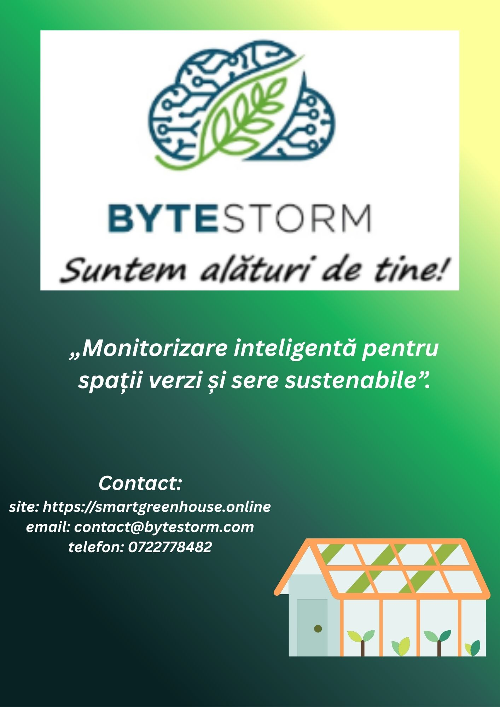

# 📈 Project Documentation & Business Strategy

This folder serves as the central repository for the non-technical artifacts of the **ByteStorm Smart Greenhouse** project. It contains the strategic framework, business logic, market analysis, and product roadmap that guided the technical development of the application.

## 📂 Key Documents

The following documents detail the entrepreneurial vision and strategic planning behind ByteStorm:

* **[Business Plan (PDF)](./Plan%20de%20afaceri%20final%2020.09.2025.pdf)**
    * **Content:** A comprehensive 50+ page document covering the executive summary, organizational structure, financial projections (P&L, Cash Flow), and risk analysis (Ishikawa diagrams).
    * **Highlight:** Includes detailed strategies for B2B (small farmers) and B2C (hobbyists) market penetration.

* **[MVP Functional Requirements (PDF)](./Funcționalități%20MVP%20pentru%20aplicația%20de%20monitorizare%20spatii%20verzi.pdf)**
    * **Content:** The definitive list of "Must-Have" features for the Minimum Viable Product launch.
    * **Key Features:** Real-time monitoring, automated irrigation control, sensor installation protocols, and integrated technical support.

* **[Competitor Analysis (ODT)](./Analiza%20concurentei.odt)**
    * **Content:** A comparative analysis of key market players (Netafim, BlueMonitor, Hengko).
    * **Strategy:** Identifies ByteStorm's unique selling proposition (USP) as an accessible, "plug-and-play" integrated solution, contrasting with the expensive or overly complex alternatives.

* **[Project Presentation (PDF)](./Presentation%20-%20Aplicație%20Mobilă%20pentru%20Monitorizarea%20Serei%20(9).pdf)**
    * **Content:** The pitch deck used for stakeholder presentations, summarizing the problem, solution, and app interface visualization.

* **[Entrepreneur's Decalogue (DOCX)](./Decalogul%20antreprenorului.docx)**
    * **Content:** The core values and guiding principles for the management team, emphasizing integrity, creativity, and resilience.

---

## 🎯 Product Vision & Market

**ByteStorm** is designed to bridge the gap between complex industrial agriculture technology and accessible smart gardening.

### Target Segments
1.  **B2B (Small & Medium Farmers):**
    * **Pain Point:** High labor costs and time-consuming manual monitoring.
    * **Solution:** Automation of irrigation/ventilation to optimize resources and increase crop yield.
2.  **B2C (Hobbyists & Urban Gardeners):**
    * **Pain Point:** Lack of technical expertise and desire for convenience.
    * **Solution:** An intuitive mobile app interface that makes greenhouse management "hands-free" and enjoyable.

### Unique Selling Proposition (USP)
Unlike competitors who offer fragmented solutions (hardware only or software only), ByteStorm provides a **fully integrated ecosystem**:
* **Hardware:** Custom sensor nodes (Raspberry Pi Pico W).
* **Software:** User-friendly mobile app.
* **Service:** Installation and technical support included.

### Marketing Material

  

---

## 🛠️ MVP Feature Set (Minimum Viable Product)

The initial product launch focuses on these core capabilities:

1.  **Real-Time Monitoring:** Live dashboard for Temperature, Air Humidity, and Soil Moisture.
2.  **Remote Automation:**
    * **Manual Toggle:** Turn pumps/fans on/off from the app.
    * **Scheduler:** Set specific time intervals for automated care.
3.  **Data Analytics:** Historical graphs (24h / 7 days / 30 days) to track environmental trends.
4.  **Technical Diagnostics:** A "Self-Health" check system that alerts users if a sensor malfunctions.
5.  **User Profiles:** Secure login and personalized settings via Firebase.

---

## 📊 Business Model & Roadmap

* **Revenue Streams:**
    * **Hardware Sales:** One-time purchase of Sensor Kits (Home & Pro versions).
    * **Subscriptions (SaaS):** Tiered monthly subscriptions (Basic, Medium, Advanced) for access to advanced analytics, alerts, and priority support.
* **Strategic Roadmap:**
    * **Phase 1 (Validation):** MVP launch, acquiring the first 1,000 users, and gathering feedback.
    * **Phase 2 (Growth):** Introducing advanced modules (pH sensors, CO2 monitoring) and B2B partnerships.
    * **Phase 3 (Leadership):** AI-driven predictive analytics and regional expansion.

---

*Note: This documentation reflects the business and planning aspect of the simulated startup project.*